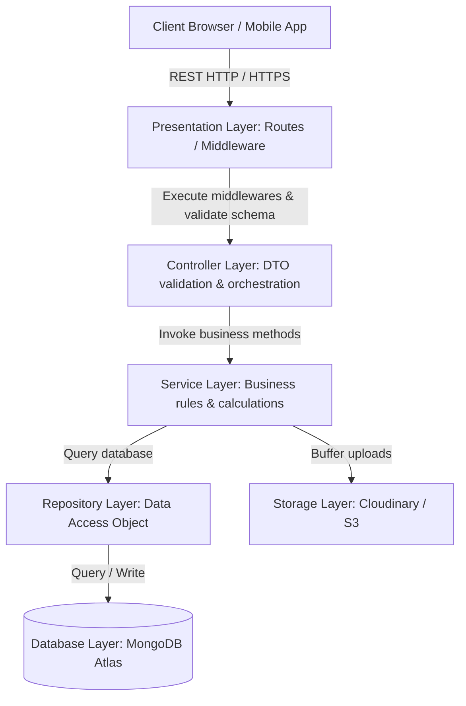

# Enterprise School ERP Backend Architecture Blueprint
## Master Specification and System Design Document

This document defines the complete backend software architecture, database design, request pipelines, security protocols, API conventions, and scalability roadmap for the School ERP SaaS application.

---

## 1. Overall Backend Architecture

The backend follows a **Layered Clean Architecture** pattern. This enforces strict separation of concerns, guarantees testability, and decouples business logic from external transports and databases.



### 1.1 Architecture Layers

#### 1. Presentation Layer
Defines the HTTP server entry point using Express.js. It manages server startup, CORS bindings, global request parsing limits, and routing mount coordinates.

#### 2. Routing Layer
Exposes REST endpoints mapped to HTTP verbs (`GET`, `POST`, `PUT`, `DELETE`). It isolates routes per domain model (e.g., `/api/v1/students`, `/api/v1/fees`) and chains initial schema validation and auth guards.

#### 3. Controller Layer
Coordinates transport payloads. It extracts route params, query queries, and body details, executes request validation filters, invokes the appropriate business services, and returns formatted HTTP responses. **Controllers contain no business logic.**

#### 4. Service Layer
The core domain engine. **All business logic, grade calculations, enrollment workflows, and state transitions reside here.** Services are transport-agnostic (can be reused by REST APIs, cron workers, or CLI scripts) and database-agnostic.

#### 5. Repository / Data Layer
Abstracts query implementations. It encapsulates Mongoose query operations (`find`, `aggregate`, `findOneAndUpdate`). Services communicate with Repositories rather than Mongoose models directly, allowing easy swaps to other ORMs/databases in the future.

#### 6. Database Layer
MongoDB Atlas configured for multi-tenant isolation. Implements collection indices, schema integrity validation, and connection pooling.

#### 7. Storage Layer
Cloudinary API adapter. Manages file streaming, document attachments, profile photo transformations, and secure signed URLs.

#### 8. Authentication Layer
Passport/JWT validation filters. Decodes Authorization headers (`Bearer <token>`), verifies signatures, checks blacklists, and attaches active session variables to request contexts.

#### 9. Authorization Layer
RBAC checking middleware. Validates user privileges against fine-grained permission registries before granting controller entry.

#### 10. Validation Layer
Express-validator schema checks. Blocks invalid data shapes at the router boundary before processing downstream logic.

#### 11. Logging Layer
Morgan request logs paired with Winston files logger. Aggregates request payloads, warnings, database execution lags, and uncaught exceptions.

#### 12. Configuration Layer
Centralized environment loader using `dotenv`. Validates required keys (ports, Mongo URIs, key secrets) on server startup and throws immediate exceptions if any are missing.

---

## 2. Request Flow Lifecycle

The following sequence details the step-by-step lifecycle of an API request:

```
[ Client Request ]
       ↓
[ Express Route Router ]
       ↓
[ Security Middlewares ] (Helmet, CORS, Rate Limiters)
       ↓
[ Authentication Guard ] (Extract JWT & authenticate session)
       ↓
[ Authorization Guard ] (Inspect role-based permission checks)
       ↓
[ Validation Pipeline ] (Express-validator schema assertions)
       ↓
[ Controller Action ] (Destructure request parameters)
       ↓
[ Domain Service ] (Execute business rules, check limits)
       ↓
[ Repository Pattern ] (Query Mongoose Model database commands)
       ↓
[ MongoDB Atlas ] (Execute queries, apply indexing)
       ↓
[ Controller Formatter ] (Format success object structure)
       ↓
[ Standard Response ] (Return HTTP status and serialized payload)
```

---

## 3. Module Component Architecture

Each business module is encapsulated inside a self-contained directory (e.g., `modules/students/`) to avoid file entanglement. A module consists of the following components:

*   **`routes.js`**: Maps endpoints to controller actions. Chains authentication and validation middlewares.
*   **`controller.js`**: Receives requests, handles serialization, and triggers services.
*   **`service.js`**: Houses business computations, validations, database writes, and external service calls.
*   **`validation.js`**: Defines express-validator rules for parameters and payloads.
*   **`model.js`**: Defines the Mongoose collection schema, pre-hooks, and indexes.
*   **`repository.js`**: Implements raw database query adapters.
*   **`constants.js`**: Stores module-specific strings, options, statuses, and configurations.
*   **`dto.js`**: Data Transfer Objects defining data shapes sent to/from the client to filter out sensitive attributes.

---

## 4. Authentication Architecture

The system implements a secure **Dual-Token JWT Authentication** mechanism:

```
                  +-------------------+
                  |   /login API      |
                  +---------+---------+
                            |
             +--------------+--------------+
             | Creates Access & Refresh   |
             | Tokens. Sets cookies.       |
             +--------------+--------------+
                            |
           +----------------+----------------+
           |                                 |
           v                                 v
+----------------------+          +----------------------+
| Access Token         |          | Refresh Token        |
| - Sent in JSON       |          | - HttpOnly Cookie    |
| - Short-lived (15m)  |          | - Long-lived (7d)    |
| - Used in Auth Header|          | - Saved in DB        |
+----------------------+          +----------------------+
```

### 4.1 Token Specifications
*   **Access Token**: Contains user payload (ID, Tenant ID, Role, Permissions). Short-lived (15 minutes). Exchanged in the HTTP `Authorization: Bearer <token>` header.
*   **Refresh Token**: Contains user ID and verification seed. Long-lived (7 days). Stored in a secure, `HttpOnly`, `SameSite=Strict`, `Secure` cookie. Stored in MongoDB under a `refreshTokens` collection to allow global logout (token revocation).

### 4.2 Cryptographic Storing
*   **Bcrypt Hashing**: User passwords are encrypted using Bcrypt with a salt factor of `12`.
*   **Signatures**: Tokens are signed using asymmetric algorithms (RS256) or high-entropy symmetric strings (HS256) managed via environment keys.

### 4.3 Recovery Workflows
*   **Forgot Password**: Generates a cryptographically secure, high-entropy random token (`crypto.randomBytes(32)`), hashes it in the DB, sets a 1-hour expiration, and dispatches a password-reset URL to the user's email via Nodemailer.
*   **Reset Password**: Accepts the raw token, hashes it to match the database record, validates the expiration window, accepts the new password, hashes it using Bcrypt, updates the database, and invalidates all active session keys.

---

## 5. Role Based Access Control (RBAC)

The system enforces hierarchical permissions. Every API action is associated with a specific permission key (e.g., `students:create`, `fees:collect`).

### 5.1 RBAC Roles Matrix

| Role | Description | Base Privileges |
| :--- | :--- | :--- |
| **Super Admin** | Platform SaaS Owner | Global tenant configurations, subscription invoices, global monitoring controls. |
| **School Admin** | Institution Admin | Full control over campus schedules, configuration setups, student admissions, teacher rosters. |
| **Teacher** | Classroom Academic manager | Daily attendance registers, homework creation, grading marks, student progress records. |
| **Parent** | Student Guardian | View child grades, submit leave applications, pay invoice statements, message teachers. |

### 5.2 Dynamic Permission Middleware
Middleware checks if the authenticated user's permissions array contains the required permission key:
```javascript
// Middleware Conceptual Logic
const checkPermission = (requiredPermission) => {
  return (req, res, next) => {
    if (req.user.role === 'super_admin') return next(); // Bypass checks for super admins
    if (req.user.permissions.includes(requiredPermission)) return next();
    return res.status(403).json({ error: "Access denied: Insufficient privileges" });
  };
};
```

---

## 6. Database Architecture

We use MongoDB Atlas for multi-tenant storage. Multi-tenancy is implemented using a **Shared Database, Shared Collections (Discriminator Column)** strategy:

```
[ MongoDB Database: school_erp_prod ]
         ↓
[ Collection: Students ]
  ├── Document 1: { tenantId: "school_A", name: "Alex Rivera", class: "Grade 10" }
  ├── Document 2: { tenantId: "school_B", name: "Chloe Chen", class: "Grade 9" }
```
Every query must include `tenantId` in its filter to enforce strict isolation.

### 6.1 Database Collections Schema Maps

#### 1. `users`
*   `_id`: ObjectId
*   `tenantId`: String (Indexed)
*   `email`: String (Indexed, unique within tenant)
*   `passwordHash`: String
*   `role`: String (enum: `super_admin`, `school_admin`, `teacher`, `parent`)
*   `status`: String (enum: `active`, `suspended`)
*   `permissions`: Array of Strings
*   `createdAt` / `updatedAt`: Dates
*   `isDeleted`: Boolean (Indexed)

#### 2. `students`
*   `_id`: ObjectId
*   `tenantId`: String (Indexed)
*   `userId`: ObjectId (Ref to `users`, nullable)
*   `admissionNo`: String (Unique within tenant)
*   `rollNo`: String
*   `firstName` / `lastName`: Strings
*   `classId`: ObjectId (Ref to `classes`)
*   `sectionId`: ObjectId (Ref to `sections`)
*   `parentUserId`: ObjectId (Ref to `users`)
*   `dob` / `gender` / `bloodGroup`: Strings
*   `status`: String (enum: `active`, `inactive`, `alumni`)
*   `medicalRecords`: Embedded Object
*   `isDeleted`: Boolean (Indexed)

#### 3. `attendance`
*   `_id`: ObjectId
*   `tenantId`: String (Indexed)
*   `studentId`: ObjectId (Ref to `students`, Indexed)
*   `date`: Date (Indexed)
*   `status`: String (enum: `present`, `absent`, `late`, `halfday`)
*   `remarks`: String

#### 4. `invoices`
*   `_id`: ObjectId
*   `tenantId`: String (Indexed)
*   `studentId`: ObjectId (Ref to `students`, Indexed)
*   `amount`: Number
*   `status`: String (enum: `paid`, `unpaid`, `partial`, `overdue`)
*   `dueDate`: Date
*   `transactions`: Array of Embedded Transaction details

### 6.2 Indexing Strategy
*   **Compound Indexes**: `{ tenantId: 1, email: 1 }` (unique) and `{ tenantId: 1, admissionNo: 1 }` (unique).
*   **Lookup Indexes**: `{ studentId: 1, date: 1 }` on `attendance` for fast historical reports.
*   **Search Indexes**: Indexing `firstName` and `lastName` to optimize directory lookups.

### 6.3 Soft Delete Strategy
No user or student documents are ever deleted permanently from the database.
*   Every collection has an `isDeleted` Boolean field.
*   All queries filter by `{ isDeleted: false }` by default.
*   Repositories override standard Mongoose query methods to inject this filter automatically, ensuring deleted records are hidden from standard directory listings.

---

## 7. File Storage Architecture

Files are processed dynamically using Multer and Cloudinary:

```
[ Client Form ] ---> [ Multer ] ---> [ Local Disk /tmp ] ---> [ Cloudinary SDK ] ---> [ Delete /tmp ]
                                                                     |
                                                                     v
                                                            [ Secure HTTPS URL ]
                                                                     |
                                                                     v
                                                            [ Save URL in Mongo ]
```

### 7.1 Pipeline Rules
1.  **Incoming Requests**: Intercepted by Multer middleware configured with file size limits (e.g., 2MB for images, 5MB for documents).
2.  **Validation**: Intercepted by checking mime-types (only `.pdf`, `.jpg`, `.jpeg`, `.png` allowed).
3.  **Upload Action**: Uploaded via secure streams using the Cloudinary Node.js SDK.
4.  **Transformations**: Profile images are auto-cropped to squares and optimized using Cloudinary's dynamic quality modifiers (`f_auto,q_auto`).
5.  **Storage**: The secure HTTPS URL returned by Cloudinary is stored in the database model. Local temporary buffer files are deleted immediately after upload.

---

## 8. API Design Standards

We follow strict RESTful API design standards to ensure developer productivity and smooth integration with future mobile applications:

*   **API Versioning**: Prefixed with `/api/v1/`.
*   **Plural Resource Naming**: `/api/v1/students`, `/api/v1/teachers`, `/api/v1/invoices`.
*   **HTTP Verbs**:
    *   `GET /api/v1/students` (Retrieve list)
    *   `POST /api/v1/students` (Create record)
    *   `GET /api/v1/students/:id` (Retrieve single record)
    *   `PUT /api/v1/students/:id` (Update record)
    *   `DELETE /api/v1/students/:id` (Soft delete record)

### 8.1 Query Parameters Standard
*   **Pagination**: `?page=1&limit=20` (offsets calculation: `(page - 1) * limit`).
*   **Filtering**: Direct key mappings: `?class=Grade10&status=active`.
*   **Sorting**: Prefix fields with `-` for descending order: `?sort=-createdAt` or `?sort=lastName`.
*   **Searching**: Global text lookup using query parameter: `?search=alex`.

---

## 9. Validation Architecture

Validation is enforced across three distinct layers to ensure system integrity:

```
+-------------------------------------------------------------+
| 1. Request Schema Validation (Express Validator)            |
|    - Type matching, pattern checking, payload constraints.   |
+------------------------------------+------------------------+
                                     |
                                     v
+-------------------------------------------------------------+
| 2. Domain / Business Validation (Service Layer)             |
|    - Check duplicate entries, seat capacity limits.         |
+------------------------------------+------------------------+
                                     |
                                     v
+-------------------------------------------------------------+
| 3. Database Schema Constraints (Mongoose Schema)            |
|    - Schema definitions, unique indexes, custom validators.|
+-------------------------------------------------------------+
```

---

## 10. Logging Strategy

Logs are categorized and written to standard streams and log files:

*   **HTTP Request Logging**: Morgan logs incoming requests (method, route, execution time, and response codes) to the standard output (`stdout`).
*   **Application Logs**: Winston handles application logs, writing to daily rotating files under:
    *   `logs/info.log` (All transactions, server starts, successful integrations)
    *   `logs/error.log` (Winston captures all status `500` stack traces)
    *   `logs/audit.log` (Logs security changes: password alterations, logins, and permission changes)

---

## 11. Error Handling

We use a centralized error handler middleware that catches all unhandled exceptions and validation errors, returning structured JSON responses:

*   **AppError Class**: Extended from `Error` class to handle custom operational exceptions (e.g., resource not found, insufficient funds, invalid credentials).
*   **Uncaught Exceptions**: Logged to `error.log` and the server is shut down gracefully.
*   **Validation Errors**: Maps express-validator arrays to structured feedback.
*   **Mongoose/MongoDB Errors**:
    *   Duplicate keys (error code `11000`) are mapped to HTTP `409 Conflict`.
    *   Cast errors (invalid ObjectIds) are mapped to HTTP `400 Bad Request`.

---

## 12. Security Architecture

Our security configuration implements OWASP top-10 defensive headers and policies:

*   **Helmet.js**: Injects secure HTTP headers (e.g., Content Security Policy, X-Frame-Options, X-Content-Type-Options) to mitigate XSS and clickjacking attacks.
*   **CORS**: Whitelists authorized frontend domains and blocks unauthorized origins.
*   **Rate Limiting**: Configured using `express-rate-limit`. Limits public routes (like `/api/v1/auth/login`) to 10 requests per minute per IP address, and standard routes to 100 requests per 15 minutes.
*   **Sanitization**: Uses filters to sanitize body inputs against MongoDB operator injection attacks (removing characters starting with `$`).
*   **Environment Variables**: All API secrets, database credentials, and SMTP configurations are stored in an encrypted `.env` file, loaded via `dotenv`, and never committed to source control.

---

## 13. Response Structure Standards

All responses conform to a unified JSON layout:

### 13.1 Success Response Structure
```json
{
  "success": true,
  "message": "Operation completed successfully",
  "data": {
    "id": "60d01b123432ab34523912a2",
    "name": "Alex Rivera"
  }
}
```

### 13.2 Paginated Response Structure
```json
{
  "success": true,
  "data": [
    { "id": "1", "name": "Alex Rivera" }
  ],
  "pagination": {
    "currentPage": 1,
    "totalPages": 5,
    "totalCount": 98,
    "limit": 20,
    "hasNextPage": true,
    "hasPrevPage": false
  }
}
```

### 13.3 Error Response Structure (General & Validation)
```json
{
  "success": false,
  "error": {
    "code": "VALIDATION_FAILED",
    "message": "The payload contains invalid fields",
    "details": [
      { "field": "email", "issue": "Invalid email address formatting" }
    ]
  }
}
```

---

## 14. Coding Standards

*   **Naming Conventions**:
    *   Files and folder structures use `camelCase` or `snake-case` consistently.
    *   Mongoose Models are named singular with camelCase casing (e.g., `Student.model.js`).
*   **Dependency Injection Rule**: Controllers must never import Mongoose models. Controllers depend on Services, and Services depend on Repositories.
*   **Single Responsibility Principle**: Services should focus on a single domain area. If a service needs data from another module, it should use that module's service class rather than importing its models or repositories directly.

---

## 15. Scalability & Future Extensions

This backend layout is designed to scale and decouple cleanly as the system grows:

*   **Mobile API Gateways**: The REST routes are versioned and return clean JSON payloads, allowing them to support iOS/Android mobile apps without requiring any controller refactoring.
*   **External Notification Service**: The service layer communicates via asynchronous events. This allows us to easily plug in microservice queues (like RabbitMQ or Redis PubSub) to offload notification dispatches (e.g., SMS, push notifications, and emails).
*   **Payment Processors Decoupling**: Payment routes trigger localized adapter layers, allowing us to swap stripe or paypal integrations without altering the core invoicing records model.
*   **AI Analytics decoupler**: An asynchronous event pipeline logs student grades and attendance records, allowing Python microservices to consume this data for student performance forecasting.
